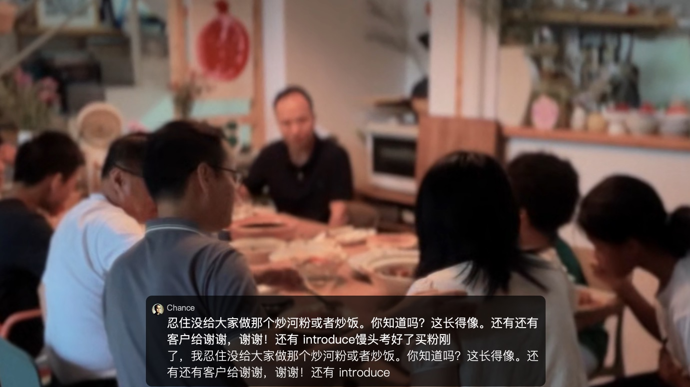

\#VibeEverything

这是一次忽然的远程"吃播"

来自马莱的独立投资人,

从广州下来的独立咨询师,带老婆儿子以及儿子邻居,

聚集在珠海 #FMHub 创始人家中聚餐,

俺则是通过 腾讯会议 远程参与午餐..

话题则是在以下多个领域中跳跃:

+ 海外Maker 经济难点

+ 分布式能源现状

+ 通证经济学新方向

+ 终身幼儿园概念拓展以及配套活动

+ 未来学游戏统计

+ 粮食危机科普形式

+ ..

涉及设备有自动人脸追踪摄像头,多对无线MIC...

不禁想到这本书:

社群运营的艺术 ~如何让你的社群更有归属感

ISBN: 9787508092317

伟大的社区总是从定期聚餐生长出来的..

大家有什么印象深刻的社区线下活动?
