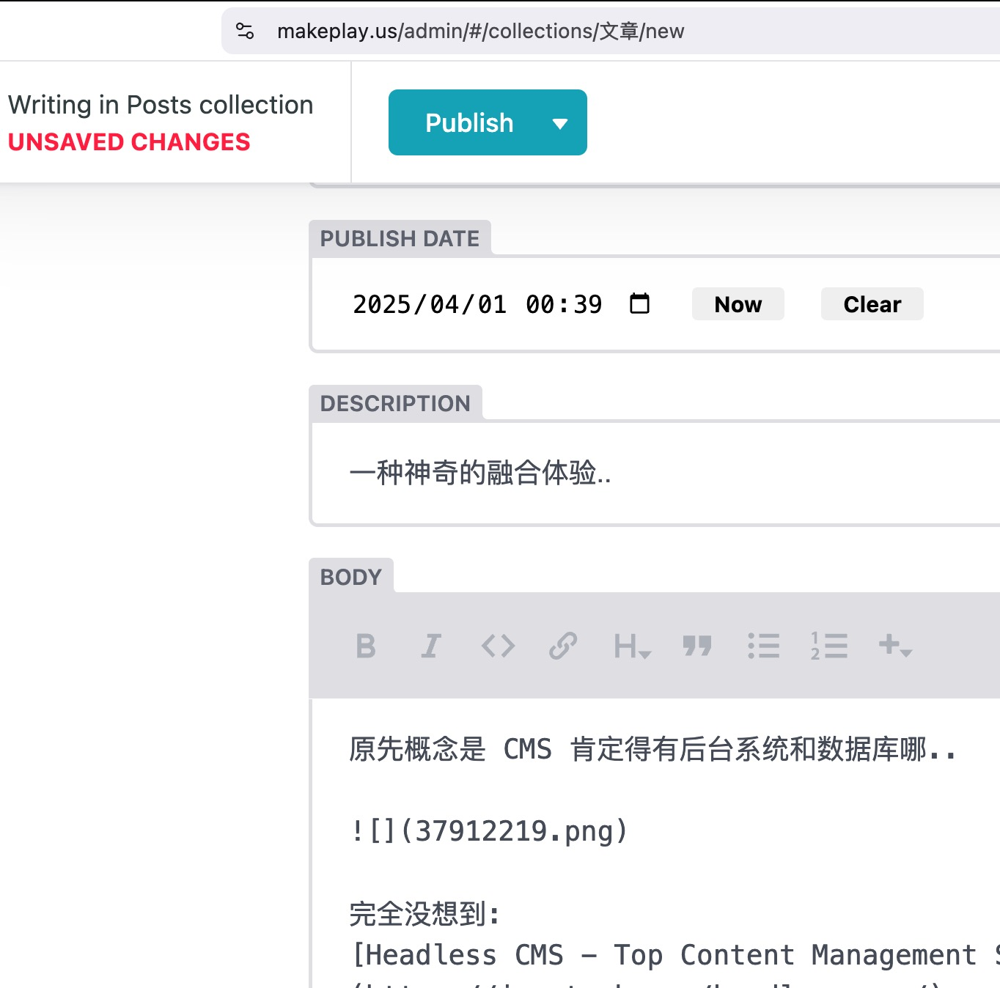

原先概念是 CMS 肯定得有后台系统和数据库哪..

完全没想到:
[Headless CMS - Top Content Management Systems | Jamstack](https://jamstack.org/headless-cms/)

有个无头 CMS 的概念, 而且还有专门基于 git 仓库进行的..

> 浏览器也已经是新一代操作系统..

这话真儿真儿的..只是, 完全想象不到是如何展开的..

